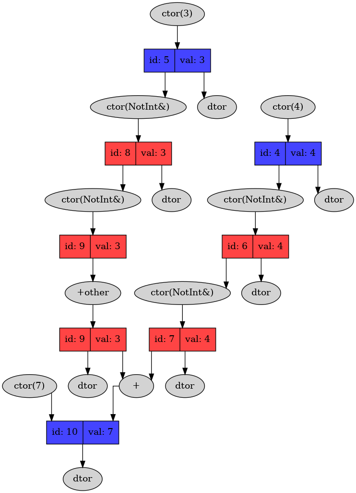
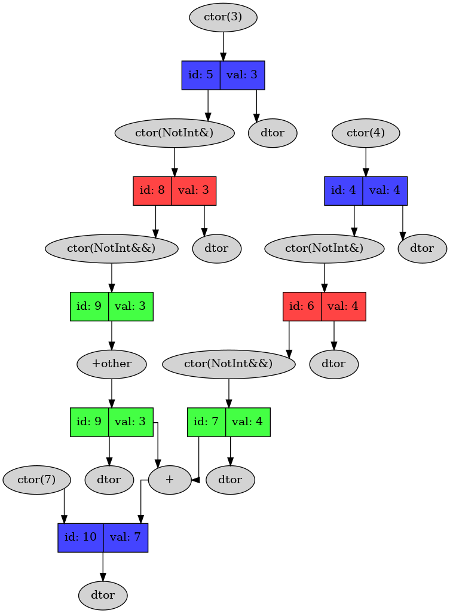

## Description

Educational project. We are researching how many useless operations happens during executing C++ program.

We create int-like type `NotInt` with dumps in every operator, constructor and destructor. And then see, how many operations happens.

## Running 

## Optimizations

### Map legend 
* `Blue rectangles`  - permanent objects
* `Green rectangles` - permanent objects, created using move semantic
* `Red rectangles`   - temporary objects
* `Grey oval nodes`  - operations

### Naive implementation without move semantic

### Add move constructor

### Replace operations that generate harmful constructions
