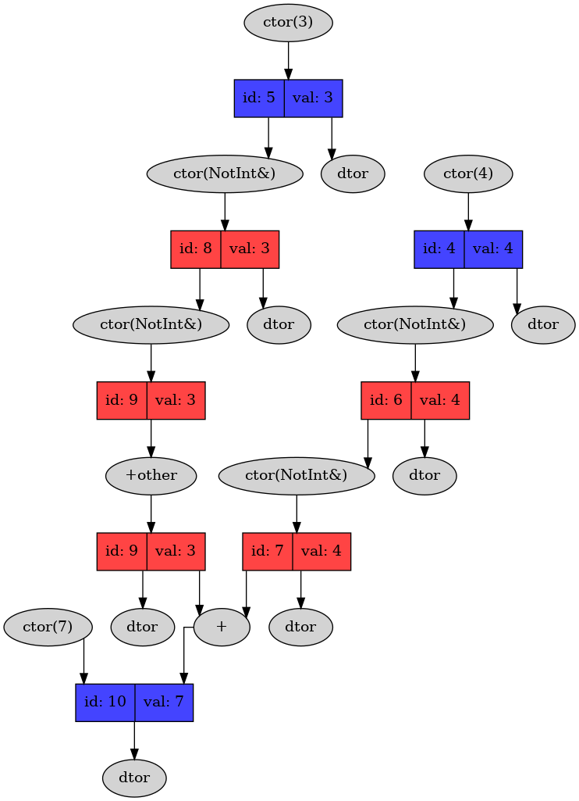
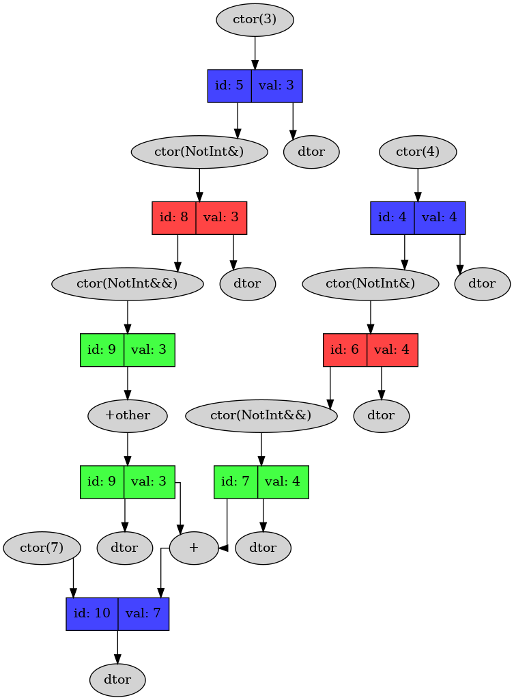
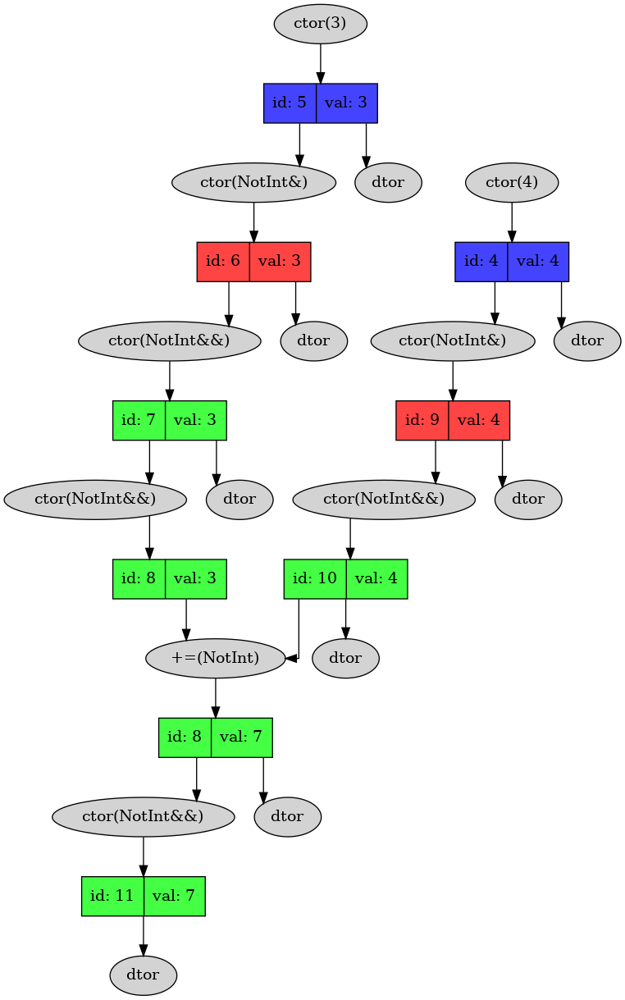
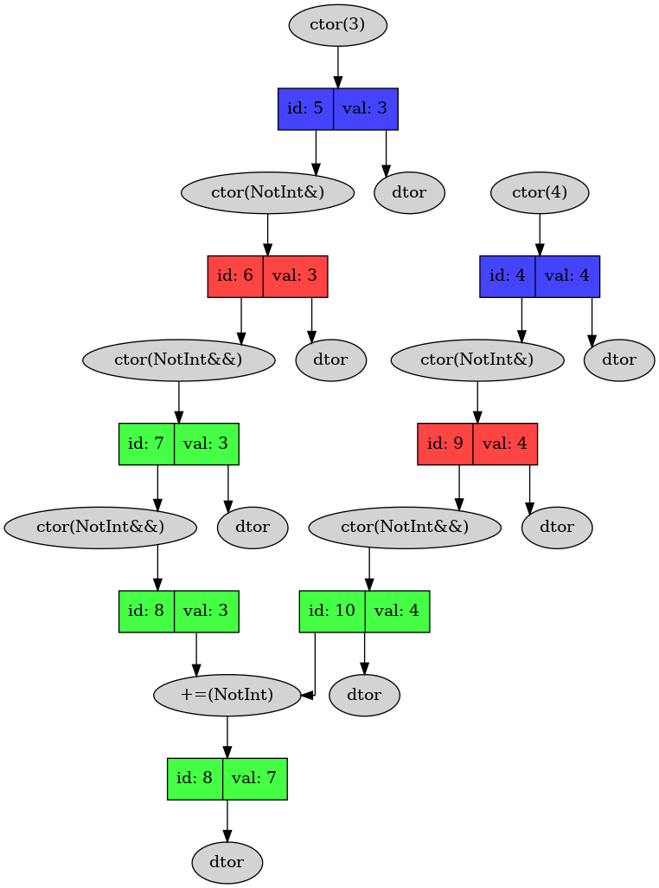

## Description

Educational project. We are researching how many useless operations happens during executing C++ program.

We create int-like type `NotInt` with dumps in every operator, constructor and destructor. And then see, how many operations happens.

## Optimizations

We will optimize this simple function.


### Map legend 
* `Blue rectangles`  - permanent objects
* `Green rectangles` - permanent objects, created using move semantic
* `Red rectangles`   - temporary objects
* `Grey oval nodes`  - operations

### Naive implementation without move semantic


### Add move constructor


### Replace operations that generate harmful constructions
Let`s remove operations, that cause harmful constructions. For example, binary + often could generate additional copy constructor.
Then code of out function will change.


And we will get this situation.


### Final result
Let's turn off -fno-elide-constructors + add -O2 compiler flags. But it doesn`t change anything.



## Configuration ##

To run the project you need install graphviz.
Then use command
```
make preparation
```
to prepare project to build.

To build project in debug mode use command
```
make debug
```

To build project in release mode use command
```
make release
```

After building project executable file is on path Exe/Run. To run project execute this file or use command
```
make run
```